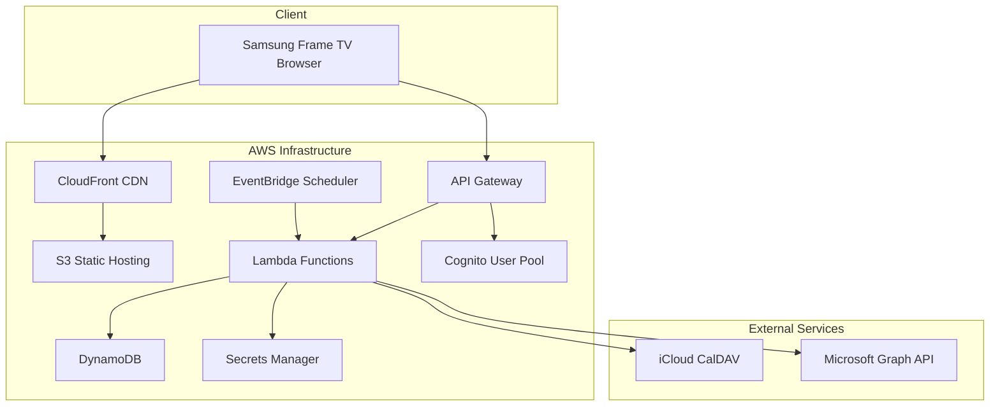

# Design Document: Family Calendar Display

## Overview

The Family Calendar Display is a web application that aggregates calendar events from multiple sources (iCloud and Outlook) and presents them in a visually appealing interface optimized for Samsung Frame TV viewing. The system uses a serverless AWS architecture with secure authentication and automatic data synchronization.

## Architecture

The system follows a serverless architecture pattern using AWS services:



## Components and Interfaces

### Frontend Components

**TV Interface (React/TypeScript)**
- `CalendarDisplay`: Main component rendering the calendar grid
- `EventCard`: Individual event display component with styling for TV viewing
- `AuthenticationWrapper`: Handles login/IP restriction logic
- `ConfigurationPanel`: Admin interface for calendar setup (mobile-optimized)
- `ArtModeView`: Minimal calendar view for Frame TV Art Mode

**Key Frontend Features:**
- Responsive design optimized for 4K TV displays
- High contrast colors and large fonts (minimum 24px)
- Touch-friendly interface for Frame TV touch capabilities
- Auto-refresh every 15 minutes
- Offline capability with cached data

### Backend Components

**API Layer (AWS Lambda + API Gateway)**
- `CalendarSyncHandler`: Orchestrates calendar data retrieval
- `AuthenticationHandler`: Manages user authentication and authorization
- `ConfigurationHandler`: Handles calendar source configuration
- `EventsHandler`: Serves aggregated calendar events to frontend

**Data Integration Services**
- `iCloudCalendarService`: CalDAV client for iCloud calendar integration
- `OutlookCalendarService`: Microsoft Graph API client for Outlook integration
- `EventAggregator`: Merges and deduplicates events from multiple sources
- `CacheManager`: Manages event caching and refresh strategies

### Data Models

**Event Model**
```typescript
interface CalendarEvent {
  id: string;
  title: string;
  description?: string;
  startTime: Date;
  endTime: Date;
  isAllDay: boolean;
  location?: string;
  source: 'icloud' | 'outlook';
  familyMember: string;
  color: string;
  recurrence?: RecurrencePattern;
}
```

**Configuration Model**
```typescript
interface CalendarConfiguration {
  familyMemberId: string;
  name: string;
  sources: CalendarSource[];
  displaySettings: DisplaySettings;
  createdAt: Date;
  updatedAt: Date;
}

interface CalendarSource {
  type: 'icloud' | 'outlook';
  credentials: EncryptedCredentials;
  calendarIds: string[];
  color: string;
  enabled: boolean;
}
```

**Authentication Models**
```typescript
interface AuthenticationConfig {
  method: 'ip-restriction' | 'cognito-login' | 'both';
  allowedIPs?: string[];
  cognitoUserPoolId?: string;
}
```

## Calendar Integration Details

### iCloud Integration
- **Protocol**: CalDAV over HTTPS
- **Authentication**: Apple ID + App-Specific Password
- **Endpoint**: `https://caldav.icloud.com/[DSID]/calendars/`
- **Data Format**: iCalendar (ICS) format
- **Refresh Strategy**: Poll every 15 minutes with ETag-based caching

### Outlook Integration  
- **Protocol**: Microsoft Graph API v1.0
- **Authentication**: OAuth 2.0 with refresh tokens
- **Endpoint**: `https://graph.microsoft.com/v1.0/me/calendars`
- **Data Format**: JSON
- **Permissions Required**: `Calendars.Read`, `offline_access`
- **Refresh Strategy**: Webhook subscriptions with 15-minute polling fallback

## Security Implementation

### Authentication Options

**IP Restriction Mode**
- CloudFront distribution with AWS WAF rules
- Configurable IP allowlist stored in DynamoDB
- Automatic blocking of unauthorized IPs

**Cognito Login Mode**
- AWS Cognito User Pool for family member authentication
- JWT tokens with 24-hour expiration
- MFA optional for enhanced security

**Hybrid Mode**
- IP restriction as first layer
- Cognito authentication for additional verification
- Configurable per-deployment

### Data Security
- Calendar credentials encrypted using AWS KMS
- Secrets stored in AWS Secrets Manager
- All API communications over HTTPS/TLS 1.3
- Event data encrypted at rest in DynamoDB

## Samsung Frame TV Optimizations

### Display Specifications
- **Resolution Support**: 4K (3840x2160), 1080p fallback
- **Browser Engine**: Chromium-based Samsung Internet
- **Supported Features**: HTML5, CSS3, ES6 JavaScript
- **Limitations**: No Flash, limited ActiveX support

### TV-Specific Features
- **Art Mode Integration**: Minimal calendar overlay when TV is in Art Mode
- **Ambient Light Adaptation**: CSS media queries for brightness adjustment
- **Remote Control Navigation**: Keyboard event handling for TV remote
- **Full-Screen Mode**: Automatic browser chrome hiding

### Responsive Design Strategy
```css
/* TV-optimized breakpoints */
@media screen and (min-width: 1920px) {
  /* 1080p TV optimization */
}

@media screen and (min-width: 3840px) {
  /* 4K TV optimization */
}

/* High contrast mode for ambient viewing */
@media (prefers-contrast: high) {
  /* Enhanced contrast styles */
}
```

## Error Handling

### Calendar Source Failures
- **Graceful Degradation**: Display cached events when sources are unavailable
- **Error Logging**: CloudWatch logs for debugging integration issues
- **User Notification**: Subtle indicators for failed calendar sources
- **Retry Logic**: Exponential backoff for temporary failures

### Authentication Failures
- **IP Restriction**: Clear error messages for blocked IPs
- **Cognito Issues**: Redirect to login with error context
- **Session Expiry**: Automatic token refresh with fallback to re-authentication

### Display Errors
- **Network Issues**: Offline mode with cached data
- **Rendering Problems**: Fallback layouts for different screen sizes
- **JavaScript Errors**: Error boundaries with graceful degradation

## Testing Strategy

The testing approach combines unit tests for individual components and property-based tests for universal correctness properties.

### Unit Testing
- **Frontend**: Jest + React Testing Library for component testing
- **Backend**: Jest for Lambda function testing with mocked AWS services
- **Integration**: End-to-end tests using Playwright for TV browser simulation
- **API Testing**: Postman/Newman for API endpoint validation

### Property-Based Testing
Property-based testing will validate universal properties using fast-check library for TypeScript. Each property test will run a minimum of 100 iterations to ensure comprehensive coverage.

*A property is a characteristic or behavior that should hold true across all valid executions of a system—essentially, a formal statement about what the system should do. Properties serve as the bridge between human-readable specifications and machine-verifiable correctness guarantees.*

## Correctness Properties

Based on the requirements analysis, the following properties ensure the system behaves correctly across all valid inputs and scenarios:

### Property 1: Calendar Source Integration
*For any* valid calendar configuration (iCloud or Outlook), when the system processes the configuration, it should successfully retrieve and display events from that calendar source.
**Validates: Requirements 1.1, 1.2**

### Property 2: Event Aggregation Consistency  
*For any* combination of multiple calendar sources, when events are retrieved from all sources, the unified view should contain all events from each source without duplication or loss.
**Validates: Requirements 1.3**

### Property 3: Graceful Degradation on Source Failure
*For any* calendar source that becomes unavailable, the system should continue displaying previously cached events and log the connection failure without crashing.
**Validates: Requirements 1.5**

### Property 4: Authentication Access Control
*For any* access attempt to the application, the authentication service should verify authorization according to the configured method (IP restriction, login, or both) before allowing access.
**Validates: Requirements 3.1, 3.2, 3.3**

### Property 5: Security Audit Logging
*For any* unauthorized access attempt, the system should log the attempt details and deny access without exposing sensitive information.
**Validates: Requirements 3.4**

### Property 6: Complete Event Information Display
*For any* calendar event, when displayed in the interface, it should show all available required information (title, date, time, duration) and optional information (location) when present.
**Validates: Requirements 4.1, 4.2**

### Property 7: Event Type Visual Differentiation
*For any* set of events containing both all-day and timed events, the display should visually distinguish between the two types consistently.
**Validates: Requirements 4.3**

### Property 8: Recurring Event Expansion
*For any* recurring event within a specified time range, the system should display all instances of the event that fall within that range according to the recurrence pattern.
**Validates: Requirements 4.4**

### Property 9: Family Member Event Distinction
*For any* collection of events from different family members, the display should provide distinct visual indicators (colors or labels) for each family member's events.
**Validates: Requirements 4.5**

### Property 10: TV Display Accessibility Standards
*For any* event display on the TV interface, the text should meet minimum font size requirements (24px+) and contrast ratios for TV viewing accessibility.
**Validates: Requirements 2.2**

### Property 11: Non-Overlapping Event Layout
*For any* set of events that overlap in time, the visual layout algorithm should arrange them so that no event display elements overlap on screen.
**Validates: Requirements 2.4**

### Property 12: Responsive Grid Layout
*For any* time period (weekly or monthly view), the interface should generate an appropriate grid structure that accommodates all events within the specified period.
**Validates: Requirements 2.3, 2.5**

### Property 13: Configuration Validation and Persistence
*For any* calendar configuration attempt, the system should validate the connection before saving, and successfully saved configurations should be retrievable and secure.
**Validates: Requirements 6.2, 6.4**

### Property 14: Real-time Configuration Updates
*For any* configuration change made through the interface, the calendar display should reflect the changes immediately without requiring a page refresh.
**Validates: Requirements 6.5**

### Property 15: Samsung Frame TV Optimization
*For any* Samsung Frame TV screen size and orientation, the interface should adapt its layout to fit the display properly with appropriate aspect ratios and full-screen capability.
**Validates: Requirements 7.1, 7.3, 7.5**

### Property 16: Ambient Display Adaptation
*For any* ambient viewing condition, the TV interface should apply appropriate brightness and contrast adjustments through CSS media queries.
**Validates: Requirements 7.4**

## Error Handling

### Calendar Source Failures
- **Graceful Degradation**: Display cached events when sources are unavailable
- **Error Logging**: CloudWatch logs for debugging integration issues
- **User Notification**: Subtle indicators for failed calendar sources
- **Retry Logic**: Exponential backoff for temporary failures

### Authentication Failures
- **IP Restriction**: Clear error messages for blocked IPs
- **Cognito Issues**: Redirect to login with error context
- **Session Expiry**: Automatic token refresh with fallback to re-authentication

### Display Errors
- **Network Issues**: Offline mode with cached data
- **Rendering Problems**: Fallback layouts for different screen sizes
- **JavaScript Errors**: Error boundaries with graceful degradation

## Testing Strategy

The testing approach combines unit tests for individual components and property-based tests for universal correctness properties.

### Unit Testing
- **Frontend**: Jest + React Testing Library for component testing
- **Backend**: Jest for Lambda function testing with mocked AWS services
- **Integration**: End-to-end tests using Playwright for TV browser simulation
- **API Testing**: Postman/Newman for API endpoint validation

### Property-Based Testing
Property-based testing will validate universal properties using fast-check library for TypeScript. Each property test will run a minimum of 100 iterations to ensure comprehensive coverage.

**Testing Framework**: fast-check for TypeScript property-based testing
**Test Configuration**: Minimum 100 iterations per property test
**Test Tagging**: Each property test must reference its design document property using the format:
`**Feature: family-calendar-display, Property {number}: {property_text}**`

**Property Test Implementation Requirements**:
- Each correctness property must be implemented as a single property-based test
- Tests should generate random valid inputs within the domain constraints
- Property tests focus on universal behaviors that should hold for all inputs
- Unit tests complement property tests by covering specific examples and edge cases

**Dual Testing Approach**:
- **Unit tests**: Verify specific examples, edge cases, and error conditions
- **Property tests**: Verify universal properties across all inputs
- Both types are complementary and necessary for comprehensive coverage